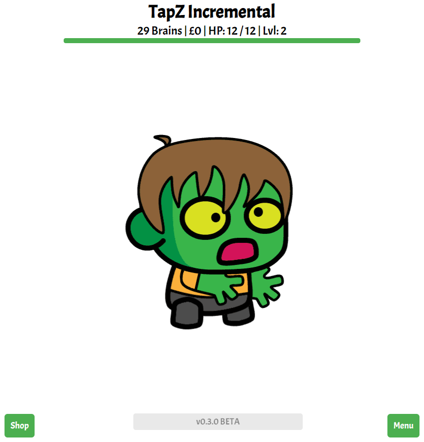
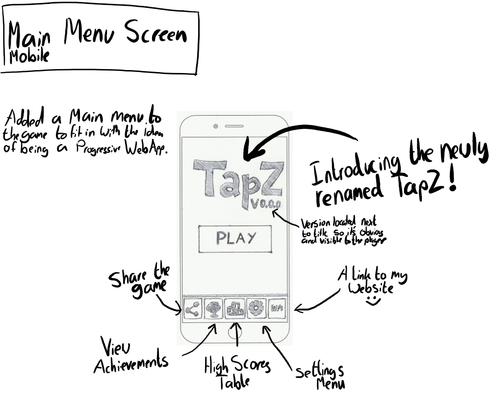
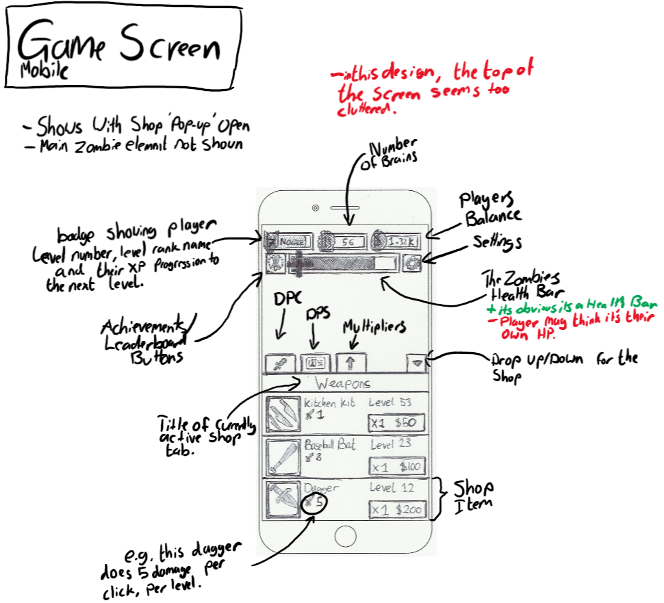

TapZ Incremental has been a project of mine for over 4 years now at this point and has been one of my most favourite
ones. However, it hasn't been without its issues. The main one being that I just wasn't ready to start such a big
project with the amount of experience that I had at that time and I didn't know how much feature creep could affect
the progress of the project.

The number of rewrites that the game has undergone in the past 4 years can no longer be counted on each hand. And that,
my friends, is why this is the end of the road for TapZ Incremental. TapZ Incremental is no more.

However, this gives me space for a new project that I am working on. That project being named TapZ.

Okay, so TapZ Incremental is technically just being renamed to TapZ and is being rewritten again, however unlike the
times previously, I believe that I now have enough experience to pull through with the TapZ project and bring it up to
a v1.0 release.

For those who don't know what TapZ Incremental was, I'll give a basic overview:

`Click Zombie -> Kill Zombie -> Sell brains it dropped -> Buy Upgrades`

So it was a pretty basic Incremental game.

if you want to play some of the old versions of TapZ, you can find them below:

-   [Live version](https://tapz.williamneild.com)
-   [Archived version at time of post](https://web.archive.org/web/20200522150053/https%3A%2F%2Ftapz.williamneild.com%2F)
-   [Archived older version](https://web.archive.org/web/20190406114711/https://tapz.realstep.co.uk/)

Note: Some archives of the game are broken, partially due to the web archive and probably partially due to my bad code.

most earlier versions were fully scrapped but if I find them buried on my hard drive somewhere, I may upload them at
some point?

Unlike the previous versions and rewrites where I just jumped in and built what I was visualising at that moment in
time, I have actually started to plan what the game will look like and started planning the UI/UX paths throughout the
game. Moreover, I plan to make the game as a progressive web application so it will also be responsive across a whole
range of devices (unlike previous versions which scaled and cropped out elements).

So this blog post is going to be pretty bland unless I do something to spice it up so ill end this post by releasing
some of the first prototype designs for the mobile screen size that I drew up.

NOTE: I am still massively in the design stage of this project so pretty much everything will change!

I hope that you stick around to see the progress of this project and enjoy the rest of your day. And if you have any
comments, suggestions or opinions on what I should add or on the designs, don't be afraid to leave a comment.
