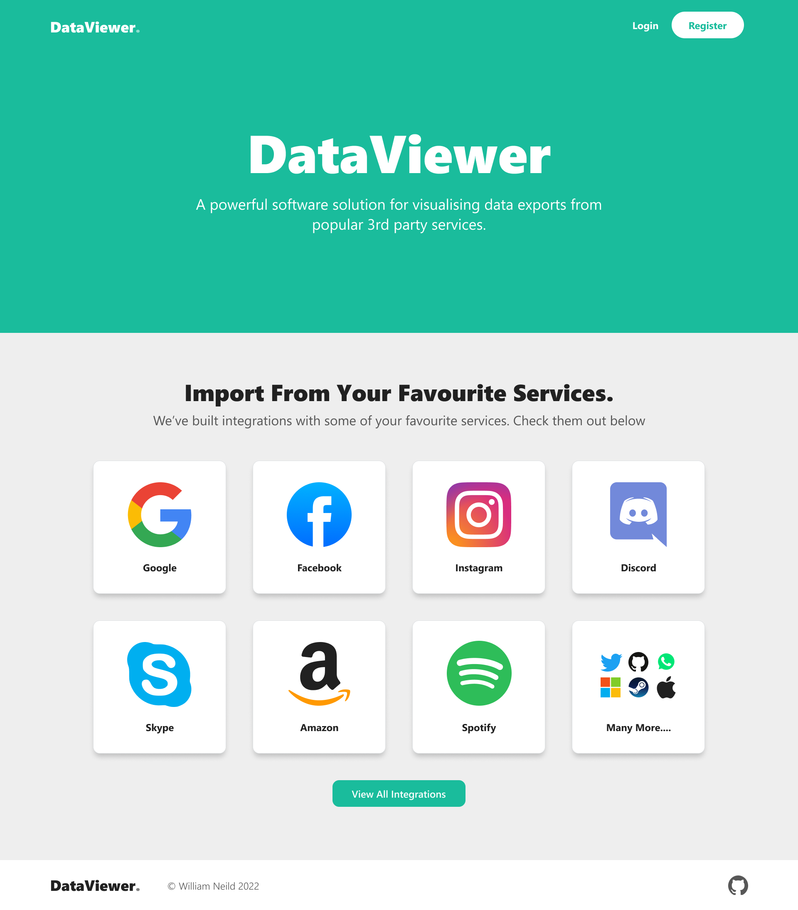
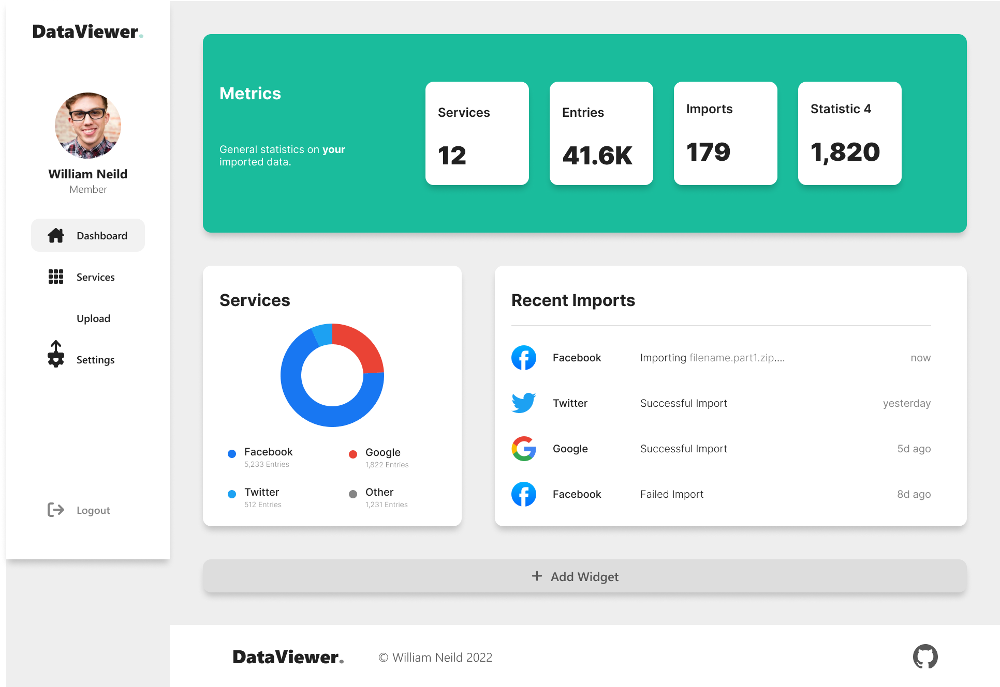
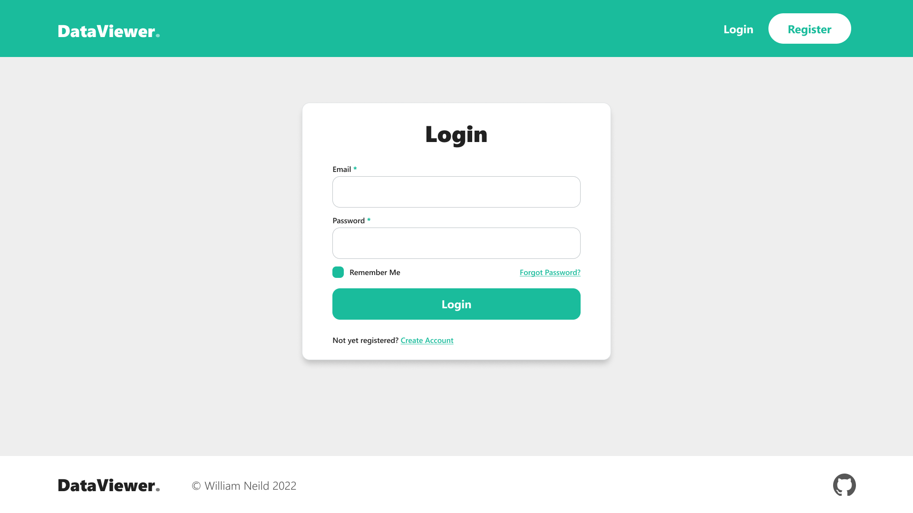
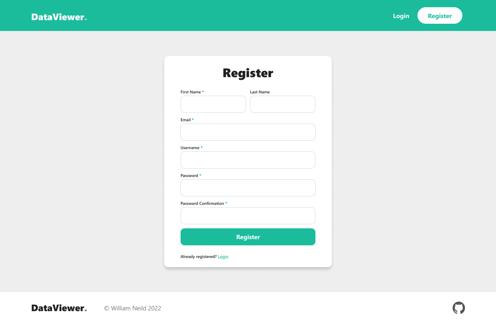
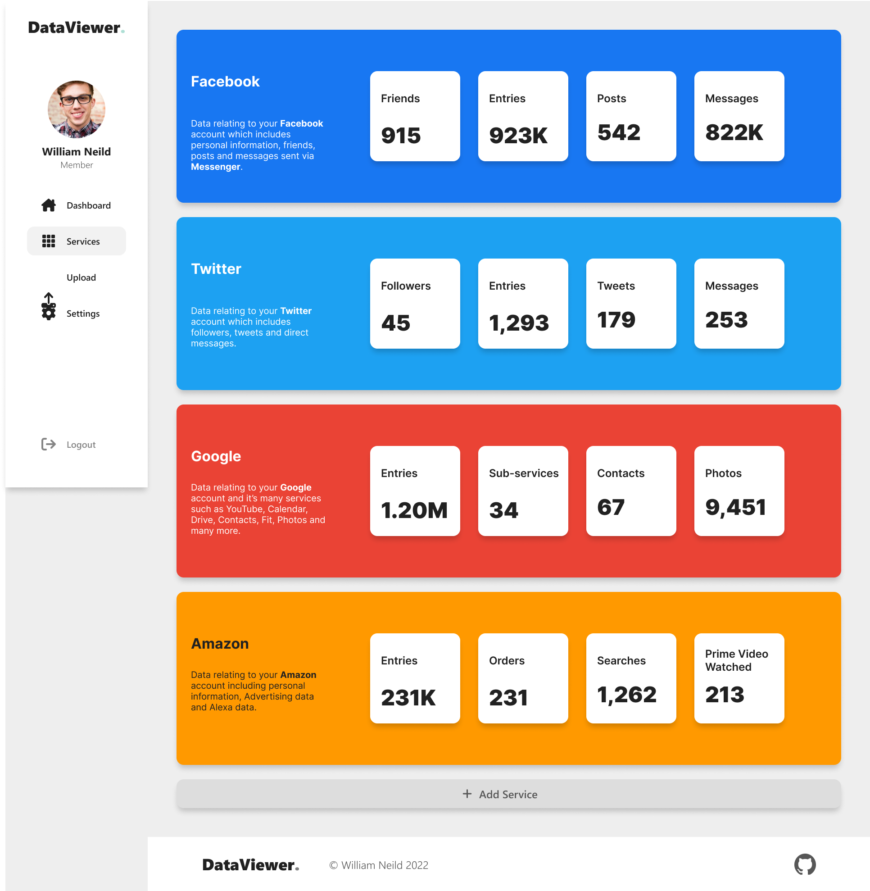
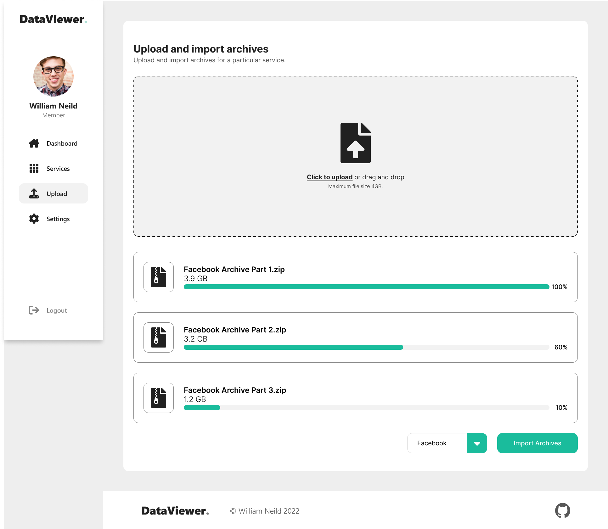

This project is currently in a very early stage - pre-prototype and mid-planning

Dataviewer is a powerful software tool that helps you organize and view all of your data from various 3rd party services in one convenient place.
With Dataviewer, you can easily import data archives and sort through them with advanced filtering and search capabilities.

One of the key features of Dataviewer is its ability to import data from a wide range of services.
Whether you are working with data from social media services, CRM systems, or online marketplaces, Dataviewer can handle it all.
This makes it the perfect solution for individuals who want to manage and analyze their own personal data from multiple servcies.

In addition to its import capabilities, Dataviewer also offers a number of powerful features for organizing and analyzing your data.
With customizable views and the ability to create reports and charts, you can easily gain insights and make informed decisions based on your data.

Overall, Dataviewer is a valuable tool for anyone looking to analyse the data that 3rd party services have on you.

### Designs
Home page:

Dashboard page:

Login page:

Register page:

Services page:

Upload page:

