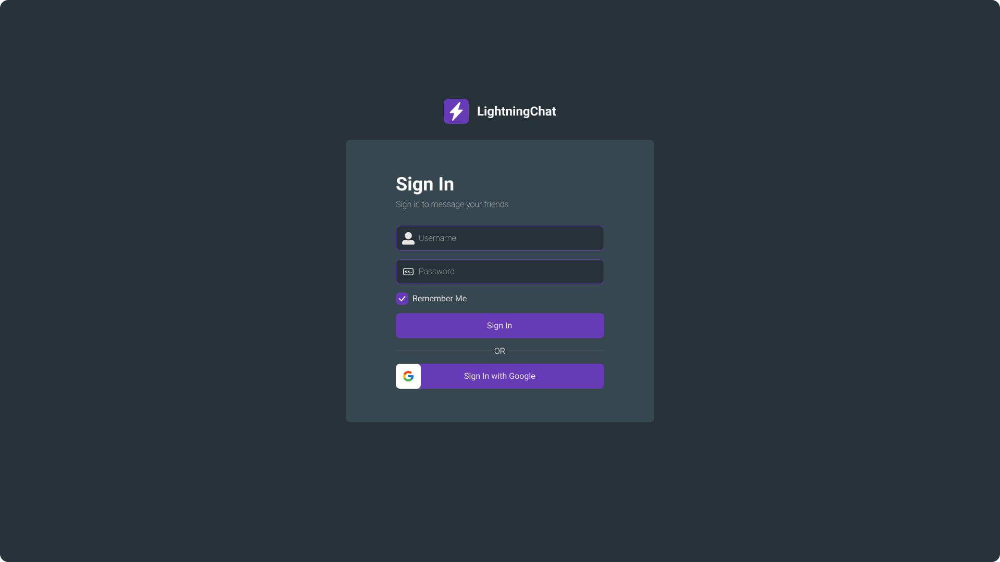
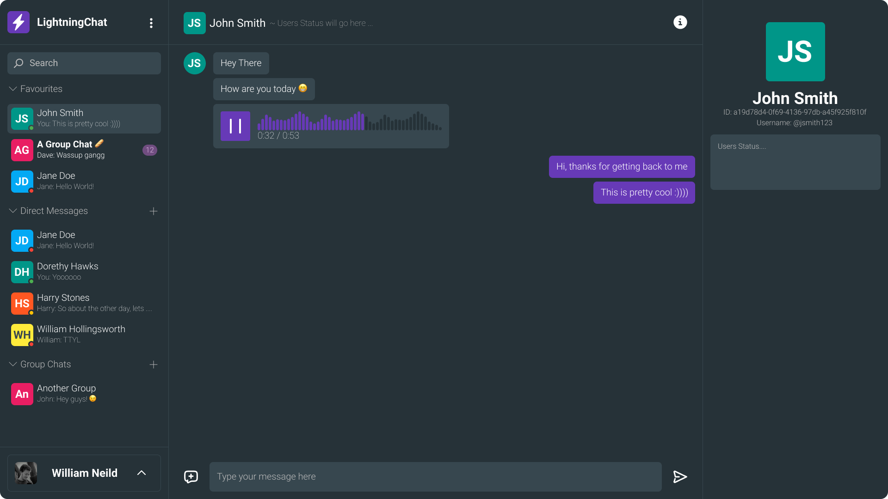

LightningChat is a free, open-source, cross-platform, and easy-to-use chat application prototype.

You can try out the version 0 of the application here:
[LightningChat v0](https://lc.williamneild.com/)

You can also try out the in-dev version of the application here:
[LightningChat DEV](https://dev.lc.williamneild.com/)

_Note that the in-dev version will **NOT** be stable, be fully functional and will not be updated regularly.
It is mainly used as a demonstration of the application architecture and testing out some different workflows._

## History

LightningChat was originally developed when I was in my first year of college (high school for americans) in 2019, due to the limitations of the college's internet, constantly blocking any form of social media or well known chat applications.
So the only solution was to develop my own of course.

After laying dormant for over 2 years, I decided to test out some UI designing tools and the project I decided to develop a UI for was LightningChat.

Although the designs were never fully completed, I was able to get a good idea of what the application should look like and how it should work.
Check out the DEV version linked above to see the new application look in action.

## Designs

Login page:

Main page:

